# Phantom AI: Systems Architecture & The Substrate Protocol

## 1. Engineering Philosophy
Phantom AI is designed as a **Forensic Substrate**. Unlike traditional analytics which track *events*, Phantom simulates *intent*. The architecture prioritizes **High-Fidelity Telemetry** and **Consensus-Driven Diagnostics**.

## 2. Component Topology

### A. The Dashboard Layer (`apps/dashboard`)
A Next.js 15 (App Router) substrate serving as the primary visualization and command interface.
- **Server-Side Forensics**: Leveraging RSC (React Server Components) for zero-latency SEO indexing on pSEO routes (`/compare/*`, `/tools/*`).
- **Telemetry UI**: WebSocket integration for real-time visualization of Ghost Swarm cognitive streams.
- **Ghost Inspector**: A client-side forensic overlay (`ghost-inspector.js`) for on-demand instrumentation of staging environments.

### B. The Core Engine (`apps/core-engine`)
An asynchronous FastAPI (Python 3.12) orchestration layer managing the Ghost Lifecycle.
- **Multi-Agent Orchestrator**: Manages the dispatch, telemetry-capture, and teardown of headless Ghost personas.
- **The Ensemble API (v1.0)**: A headless M2M endpoint for CI/CD integration, secured via the Substrate Protocol (API Keys).
- **Forensic Consensus Algorithm**:
  1. **Detection**: A primary ghost encounters a behavioral threshold (e.g., rage click, intent fracture).
  2. **Verification**: The orchestrator dispatches $N$ verifiers with jittered behavioral heuristics to eliminate false positives.
  3. **Assertion**: If reproduction rate $> = 85\%$, the friction is promoted to an **Immutable Forensic Record**.

### C. The Ethereal Pool (Simulation Grid)
Headless Chromium clusters (Playwright) executing high-entropy behavioral scripts.
- **Persona Cognitive Profiles**: JSON-driven behavior trees (e.g., "The Impatient Founder", "The Skeptical Engineer").
- **Network Throttling**: Real-time simulation of high-latency/low-bandwidth environments to detect SEO-harmful layout shifts.

## 3. The Forensic Data Pipeline

```mermaid
sequenceDiagram
    participant CLI as M2M / CI-CD
    participant App as Dashboard (Next.js)
    participant Core as Core Engine (FastAPI)
    participant Swarm as Ghost Swarm (Headless)

    CLI->>Core: POST /api/simulations/ensemble
    App->>Core: POST /api/simulations (UI-driven)
    Core-->>App: returns sim_id (Substrate Tracking)
    
    Core->>Swarm: Dispatch Cognitive Swarm
    Swarm->>Swarm: Recursive Behavioral Exploration
    
    Note over Swarm, Core: Real-time Telemetry (WebSocket)
    
    Swarm-->>Core: Friction Detected (HFS-Trigger)
    Core->>Swarm: Dispatch Consensus Verifiers
    Swarm-->>Core: Reproducibility Confirmed (0.91)
    
    Core->>Core: Index to Immortal Substrate (Persistence)
    Core-->>CLI: Final Forensic Report (JSON)
```

## 4. Scalability & Resilience
- **Non-Blocking IO**: Asyncio-based orchestration handles 10k+ parallel ghosts without thread-starvation.
- **Memory Sharding**: LRU caching for pSEO metadata ensures sub-50ms page generation at the edge.
- **Security**: Strict CORS and JWT-based telemetry authorization ensure forensic provenance.

---
*Status: YC_S26_ARCH_STABLE*
