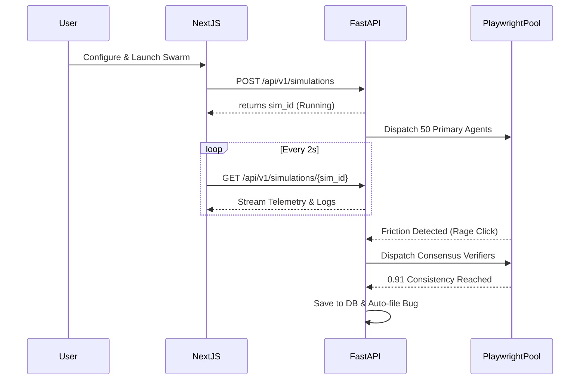

# Systems Architecture and Design

## Philosophy
As a founding engineer, focus on iteration speed without sacrificing data integrity. The system needs to be scalable to handle massive bursts of headless browsers, but simple enough to trace the origin of a failed interaction within seconds.

## Components

### 1. The React Dashboard (`frontend/`)
A Next.js 14 application serving dual purposes:
- **`tryphantom.dev`**: The marketing funnel and waitlist capture.
- **`app.tryphantom.dev`**: The authenticated command center.
Data fetching relies on native Next.js server components where feasible, maintaining client components strictly for the real-time simulation view and data viz.

### 2. Orchestration Engine (`backend/`)
The brain of the operation. Built in Python using FastAPI.
- **Async Execution**: We rely on Python's `asyncio` to manage hundreds of concurrent WebSocket connections to the browser pools.
- **Multi-Agent Consensus Layer**: A proprietary algorithm determining validity:
  1. A primary agent encounters friction (e.g., rage click, layout shift).
  2. The orchestrator dispatches $N$ verification agents with slightly jittered heuristics.
  3. If $\ge 85\%$ of verifiers reproduce the fault, it counts as a Confirmed Bug.

### 3. Chromium Headless Pool (`infra/Browserless`)
Phantom executes interactions using Playwright connected to a remote Browserless/Chromium grid. 
- Agents are configured dynamically per-run (device simulation, geo-spoofing, network throttling).
- **Zero-Trust**: Every session is an ephemeral incognito context. No cookies or local storage persist between runs.

## Event Pipeline

